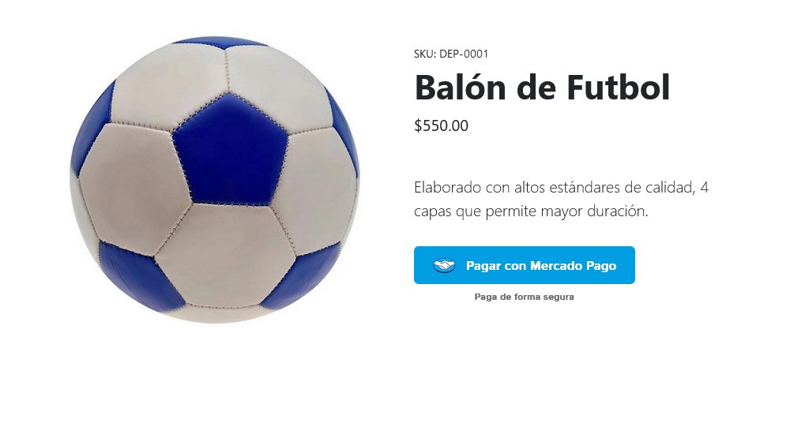
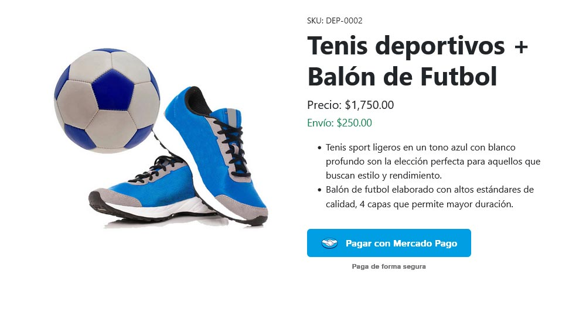

# Integración de Mercado Pago Checkout Pro Con PHP y Javascript

Este repositorio contiene ejemplos de integración de Mercado Pago Checkout Pro en PHP y JavaScript. Se divide en tres carpetas:

- Integración simple
- Integración avanzada
- Recibir notificaciones Webhooks de pagos

## Requerimientos 📋

- Cuenta de Mercado Pago y Credenciales
- PHP 8.2 o superior.
  - cURL
  - OpenSSL
  - Certificado SSL
- Composer

## Implementación Básica 💳

La carpeta [integracion-simple](integracion-simple) contiene un ejemplo sencillo de cómo integrar Mercado Pago Checkout Pro en tu sitio web usando PHP y JavaScript.

En el archivo `index.php` agrega tu `ACCESS_TOKEN`

```
MercadoPagoConfig::setAccessToken("PROD_ACCESS_TOKEN");
```

También agrega tu `PUBLIC_KEY` 

```
const mp = new MercadoPago('YOUR_PUBLIC_KEY', {
    locale: 'es-MX'
 });
 ```



**Link del vídeo:** [https://youtu.be/Otv0sFh10hw](https://youtu.be/Otv0sFh10hw)

## Personalización Avanzada ⚙️

La carpeta [integracion-avanzada](integracion-avanzada) contiene un ejemplo de cómo personalizar Mercado Pago Checkout Pro para mejorar la experiencia del usuario.



En el archivo `index.php` agrega tu `ACCESS_TOKEN` 

```
MercadoPagoConfig::setAccessToken("PROD_ACCESS_TOKEN");
```

También agrega tu `PUBLIC_KEY`

```
const mp = new MercadoPago('YOUR_PUBLIC_KEY', {
    locale: 'es-MX'
 });
 ```

**Link del vídeo:** [https://youtu.be/pCYpPqGoUqM](https://youtu.be/pCYpPqGoUqM)

## Notificaciones WebHooks 🔔

La carpeta [webhooks](webhooks) contiene un ejemplo para recibir los mensajes de eventos de pagos, además de mostrar las acciones necesarias que debes realizar para que Mercado Pago valide que las notificaciones han sido recibidas correctamente.


Configura tu `notification_url` en la personalización del Checkout Pro para apuntar al archivo `index.php` de esta carpeta:

```
'notification_url' => 'https://dominio.com/index.php'
```

En el archivo `index.php` que recibe las notificaciones, agrega el mismo `ACCESS_TOKEN` que usas en la personalización del Checkout:

```
MercadoPagoConfig::setAccessToken("PROD_ACCESS_TOKEN");
```

**Link del vídeo:** [https://youtu.be/RhK5PrQJGMI](https://youtu.be/RhK5PrQJGMI)

 ## Autores ✒️
- **Marco Robles** - *Desarrollo* - [mroblesdev](https://github.com/mroblesdev)

## Licencia 📄

Este proyecto está bajo la Licencia MIT License - mira el archivo [LICENSE](LICENSE) para más detalles.

## Expresiones de Gratitud 🎁

* Comenta a otros sobre este proyecto 📢
* Invita una cerveza 🍺 o un café ☕ [Da clic aquí](https://www.paypal.com/paypalme/markorobles?locale.x=es_XC.) 
* Da las gracias públicamente 🤓.